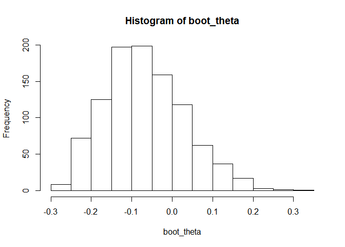
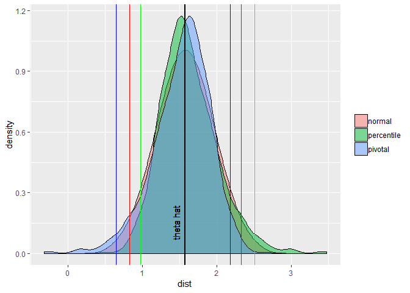
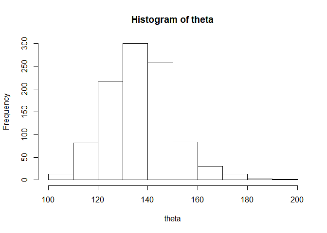
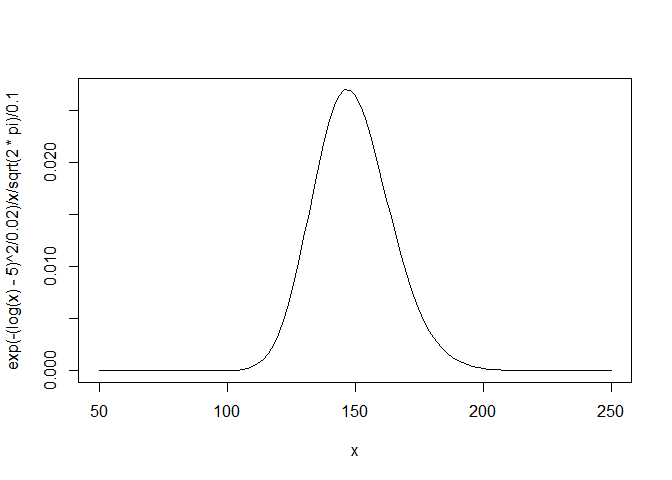
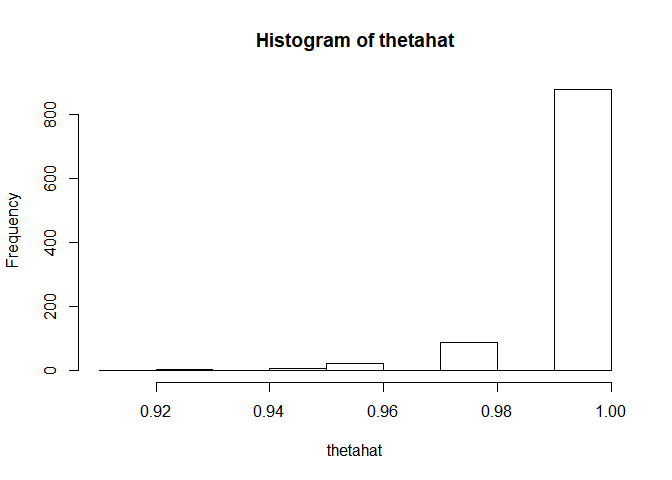
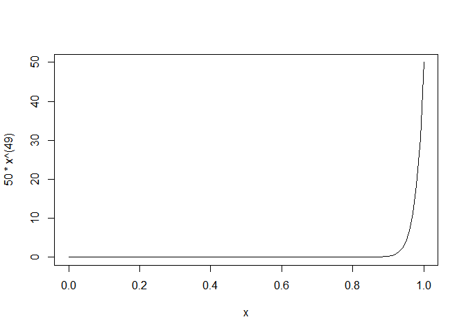

---
title: "The Bootstrap"
author: "李心珺 祁冠瑛"
date: "2018年9月"
output:
  html_document:
    keep_md: yes
  word_document: default
---

## Bootstrap方法源起

统计推断(Statistical Inference)一直是统计学领域关注的重要话题。如何估计统计量的方差、如何估计置信区间，至始至终是学者们讨论的重要问题。在上世纪中后叶，随着计算机的发明与算力的发展，诸如Jacknife、Bootstrap这一类基于非参模拟的方法被广泛关注并得到了大量的应用。

Jackknife法最早由Quenouille[3]于1949年提出，用于对偏差项进行估计，但并没有得到学界太大关注。 1958年，Tukey[4]重新回顾了这一方法，并将其应用于对标准差的估计上。这一方法理论和计算简洁，并可以用于统计学界始终关注的标准差（方差）估计问题上，从而得到了学界的大量关注。Efron[2]受Jackknife法的启发，在1979年提出Bootstrap法。其也在后续工作中指出，Jackknife实际上可视为对Bootstrap法的线性估计。本文主要介绍Bootstrap方法的基本思想，结合例子说明Bootstrap方法的应用，并在文后简要介绍Jackknife方法。


## Bootstrap方法的基本思想


### 统计模拟思想

 $Y_1,Y_2,\cdots,Y_B$ 是从分布 $G$ 中抽取的iid样本, 如果 $h$ 是一个使 $\int h(y)dG$ 收敛的函数, 则:


$$
  \frac{1}{B}\sum_{j=1}^Bh(Y_j)\stackrel{ P}{\longrightarrow} \int h(y)dG=\mathbb{E}(h(Y))
  \tag {1.1}
$$


当 $B\rightarrow \infty$ 时. 特别的:

$$
  \frac{1}{B}\sum_{j=1}^B (Y_j-\overline{Y})^2 =\frac{1}{B}\sum_{j=1}^B {Y_J}^2-( \frac{1}{B}\sum_{j=1}^B Y_j)^2 \stackrel{ P}{\longrightarrow} \int y^2dG - (\int ydG)^2 =\mathbb{V}(Y)
  \tag {1.2}
$$


这为使用统计模拟的方法估计方差提供了一个思路.


### Bootstrap的步骤

Bootstrap 是一种统计模拟的方法,最早由Efron[2]在1979年提出, 可用于统计量的方差估计和估计统计量的置信区间. 以下是《All of Statistics》[1]书中对 Bootstrap 的定义:

> The bootstrap is a method for estimating standard errors and computing confidence intervals.

Bootstrap包含两个步骤:

> **Step 1**: Estimate $\mathbb{V}_F (T_n)$ with $\mathbb{V}_{\hat{F}_n}(T_n)$.
> **Step 2**: Approximate $\mathbb{V}_{\hat{F}_n}(T_n)$ using simulation.

Step 2 常见的具体做法是: 从抽取的容量为n的样本$\hat{F_n}$中不放回的抽取$X_1^*,\cdots,X_n^*$, 并计算$T_n^*=g(X_1^*,\cdots,X_n^*)$. 通过观察$T_n^*$的分布, 可以估计 $\mathbb{V}_{\hat{F}_n}(T_n)$


## 用Bootstrap进行方差估计

根据我们刚刚学习到的内容，我们可以利用随机模拟来近似$V_{\hat{F_{n}}}(T_{n})$。$V_{\hat{F_{n}}}(T_{n})$代表“当样本的分布为$\hat{F_{n}}$时$T_{n}$的方差”。当我们假设样本的分布为$\hat{F_{n}}$时我们如何模拟$T_{n}$的分布？答案是先生成服从分布$\hat{F_{n}}$的样本${X_{1}}^{*}$,...,${X_{n}}^{*}$，然后计算${T_{n}}^{*}=g({X_{1}}^{*},...,{X_{n}}^{*})$。这组成了$T_{n}$的分布中的一部分。这个思想可以用下面的图表来阐述：

>  真实情况：$F$ $\Rightarrow$ $X_{1},...,X_{n}$ $\Rightarrow$ $T_{n}=g(X_{1},...,X_{n})$

>  在Bootstrap 下：$\hat{F}_{n}$ $\Rightarrow$ $X^{*}_{1},...,X^{*}_{n}$ $\Rightarrow$ $T^{*}_{n}=g(X^{*}_{1},...,X^{*}_{n})$


我们如何生成服从$\hat{F_{n}}$的样本${X_{1}}^{*}$,...,${X_{n}}^{*}$？注意到在$\hat{F_{n}}$的分布中，${X_{1}}$,...,${X_{n}}$这样的每一个样本点概率均为1/n。所以生成样本的方法为：
**得到一个服从$\hat{F_{n}}$分布的样本等价于从原始的数据集中随机抽取一个样本。**

所以，要生成${X_{1}}^{*}$,...,${X_{n}}^{*}\sim\hat{F_{n}}$，不放回地从原样本数据${X_{1}}$,...,${X_{n}}$中抽取n个样本就足够了。下面是整个过程的总结：

* 利用Bootstrap进行$T_n$的方差估计
1. 生成${X_{1}}^{*}$,...,${X_{n}}^{*}\sim\hat{F_{n}}$
2. 计算${T_{n}}^{*}=g({X_{1}}^{*},...,{X_{n}}^{*})$
3. 重复步骤1和2，B次，来得到${T_{n,1}}^{*}$,...,${T_{n,B}}^{*}$
4. 令$v_{boot}=\frac{1}{B}\Sigma^{B}_{b=1}{({T_{n,b}}^{*}-\frac{1}{B}\Sigma^{B}_{r=1}{T_{n,r}}^{*})}^{2}$

### 例子

下面的过程展示了如何利用Bootstrap来估计中位数的标准差

```r
>  Bootstrap for The Median

Given data X =(X(1),...,X(n))

T<-median(X)
Tboot<-vector of length B
for(i in 1:B){
Xstar<-sample of size n from X(with replacement)
Tboot[i]<-median(Xstar)
}
se<-sqrt(variance(Tboot))
```

这个过程中运用了两个近似：第一个近似为用$V_{\hat{F_{n}}}(T_{n})$来近似$V_{F}(T_{n})$，这里的逼近误差取决于$\hat{F_{n}}$与$F$的接近程度，由样本量$n$控制，并不能通过Bootstrap法减小；而第二个近似为用$v_{boot}$来近似$V_{\hat{F_{n}}}(T_{n})$，这个近似的误差由重抽样样本量$B$控制，随着$B$趋于无穷而趋为零。

## Bootstrap置信区间

类似于方差的估计，通过Bootstrap, 有以下3种方式可以估计置信区间.


### 方法 1: 基于正态假设的置信区间.

在分布接近正态分布时，例如满足正态性假设或者中心极限定理，可以使用如下公式计算和估计统计量$T_n$的置信区间:

$$
  T_n \pm z_{\alpha/2} \cdot \hat{se}_{boot}
  \tag {3.1}
$$


其中 $\hat{se}_{boot}=\sqrt{var_{boot}}$ 是标准差的Bootstrap估计, $z_{\alpha/2}$ 是标准正态分布的 $\alpha/2$ 分位数.

此方法计算简单, 但需先验证数据是否服从正态分布. 若分布情况与正态相差较大, 则所得结果不准确.


### 方法 2: 基于枢轴量的Bootstrap置信区间

枢轴量的定义如下:

$$
  R_n=\hat{\theta}_n-\theta
  \tag{3.2}
$$

其中 $\theta=T(F)$, $\hat{\theta}_n=T(\hat F_n)$.

与传统的枢轴量法构造执行区间类似，方法2主要思想是利用构造关于枢轴量的置信区间,作为中间产物，然后来对$\theta$的置信区间进行计算。即构造$(\hat{R}_{n,\alpha},\,\hat{R}_{n,1-\alpha})$，从而$\theta$的置信区间为$(\hat{\theta}-\hat{R}_{n,1-\alpha},\,\hat{\theta}-\hat{R}_{n,\alpha})$。区别在于这里关于枢轴量置信区间的构造利用的是Bootstrap方法。

$1-\alpha$ Bootstrap pivotal confidence interval 定义如下:


$$
  C_n=((2\hat{\theta}_n-\hat{\theta^*}_{1-\alpha/2}),(2\hat{\theta}_n-\hat{\theta^*}_{\alpha/2}))
  \tag{3.3}
$$

其中 $\hat{\theta^*}_{1-\alpha/2}$, $\hat{\theta^*}_{\alpha/2}$ 分别是伪样本 $\{\theta_{n,B}^*\}$ 的 $1-\alpha/2$, $\alpha/2$ 分位数.

为了验证以上方法的可行性, 下面引入一个定理.

> **Theorem.**   Under weak conditions on T(F),
>
> $$\mathbb{P}_F(T(F) \in C_n) \rightarrow 1-\alpha \tag{3.4}$$
>
> as $n\rightarrow\infty$ and $B\rightarrow\infty$, where $C_n$ is given in $(3.3)$


证明的基本思路主要是叙述$R_n$置信区间与$\theta$置信区间之间的联系。

设$R_n$的累积分布函数为:

$$
  H(r)=\mathbb{P}_F(R_n \le r)
  \tag{3.5}
$$

设$C_n^*=(a,b)$为重抽样样本量$B$趋于无穷时$C_n$的渐近值, 其中, $a=\hat{\theta_n}-H^{-1}(1-\frac{\alpha}{2})$, $b=\hat{\theta_n}-H^{-1}(\frac{\alpha}{2})$.
则:

\begin{align}
  \mathbb{P}(a \le \theta \le b)
  &=\mathbb{P}(\hat{\theta_n}-H^{-1}(1-\frac{\alpha}{2}) \le \theta, \hat{\theta_n}-H^{-1}(\frac{\alpha}{2}) \ge \theta)\\
  &=\mathbb{P}(\hat{\theta_n}-\theta \le H^{-1}(1-\frac{\alpha}{2}), \hat{\theta_n}-\theta \ge H^{-1}(\frac{\alpha}{2}))\\
  &=\mathbb{P}(\hat{\theta_n}-\theta \le H^{-1}(1-\frac{\alpha}{2}))-\mathbb{p}(\hat{\theta_n}-\theta \le H^{-1}(\frac{\alpha}{2}))\\
  &=1-\frac{\alpha}{2}-\frac{\alpha}{2}=1-\alpha
\end{align}

 $\theta$ 落在区间 $C_n$ 中的概率为 $1-\alpha$.

同时, 有:

$$
  \hat{H}(r) =\sum_{b=1}^B I(R^*_{n,b} \le r) \tag{3.6}
$$

其中 $I$ 为特征函数, 即用样本中小于$r$的比例来估计$H(r)$.

$\hat{\theta_n}-\theta=R_n \sim H$, 用 $\hat{\theta^*_r}-\hat{\theta}$ 来估计 $H^{-1}(r)$, 即 $\hat{H}^{-1}(r)=\hat{\theta^*_r}-\hat{\theta}$

$\hat{H}^{-1}(r) \rightarrow H^{-1}(r)$, 当 $n\rightarrow \infty$,
$\therefore \hat{a}=\hat{\theta_n}-\hat{H}^{-1}(1-\frac{\alpha}{2}) \rightarrow a$, $\hat{b}=\hat{\theta_n}-\hat{H}^{-1}(\frac{\alpha}{2}) \rightarrow b$,

$\therefore \mathbb{P}_f(T(F) \in C_n) \rightarrow 1-\alpha$.


### 方法 3: 直接利用Bootstrap分位数构造.

考虑完方法2，我们自然会有新的想法。既然我们可以用$\hat{F}_n$近似$F$, 我们自然可以用$\hat{F}_n$的分位数近似$F$的分位数。于是，与构造枢轴量的方法相对比，为什么不直接构造$\theta$的Bootstrap分位数？下面即是这种想法的实现。

The Bootstrap percentile interval:


$$
  C_n=( \theta_{\alpha/2}^* , \theta_{1-\alpha/2}^* )
  \tag{3.7}
$$


如果$n\rightarrow \infty$, 且$\hat\theta^*$对称分布,有 Bootstrap percentile interval = Pivotal intervals。


下面我们用一个具体例子说明上述三种方法具体是如何实现的。

> **Example.** This example is from Efron and Tibshirani (1993). When drug companies introduce new medications, they are sometimes required to show bioequivalence. This means that the new drug is not substantially different than the current treatment. Here are data on eight subjects who used medical patches to infuse a hormone into the blood. Each subject received three treatments: placebo, old-patch, new-patch.


```r
## import data

data=data.frame(matrix(c(1,9243,17649,16449,8406,-1200,2,9671,12013,14614,2342,2601,3,11792,19979,17274,8187,-2705,4,13357,21816,23798,8459,1982,5,9055,13850,12560,4795,-1290,6,6290,9806,10157,3516,351,7,12412,17208,16570,4796,-638,8,18806,29044,26325,10238,-2719),8,6,byrow = TRUE))

names(data)<-c('subject','placebo','old','new','old-placebo','new-old')

data   # raw data
```

```
##   subject placebo   old   new old-placebo new-old
## 1       1    9243 17649 16449        8406   -1200
## 2       2    9671 12013 14614        2342    2601
## 3       3   11792 19979 17274        8187   -2705
## 4       4   13357 21816 23798        8459    1982
## 5       5    9055 13850 12560        4795   -1290
## 6       6    6290  9806 10157        3516     351
## 7       7   12412 17208 16570        4796    -638
## 8       8   18806 29044 26325       10238   -2719
```

> Let Z = old-placebo and Y = new-old. The Food and Drug Administration (FDA) requirement for bioequivalence is that $|\theta|\le .20$ where $\theta = \frac{\mathbb{E}_F(Y)}{\mathbb{E}_F(Z)}$.

下面通过Bootstrap方法验证是否达到$|\theta|\le .20$


```r
## Calculate theta hat

Y<-data$`new-old`
Z<-data$`old-placebo`

theta_hat=mean(Y)/mean(Z)

theta_hat        #  estimated theta (theta hat)
```

```
## [1] -0.0713061
```

首先计算得到$\hat\theta=-.071$, $|\hat \theta|\le.20$. 在通过Bootstrap确定置信区间.


```r
## Bootstrap simulation

B=1000
set.seed(1)

samp=function(){  #this function is to calculate a sample's theta
  sam=sample(1:8,8,replace = TRUE)
  return(mean(Y[sam])/mean(Z[sam]))
}

boot_theta<-replicate(B,samp())  # generate Bootstrap sample


sd(boot_theta)   #标准差
```

```
## [1] 0.09792018
```

```r
hist(boot_theta) #分布
```

<!-- -->

```r
PerI=quantile(boot_theta,c(.025,.975))   # percentile interval

PivI=quantile(2*theta_hat-boot_theta,c(.025,.975))   # pivotal confidence interval


PivI   # 95% pivotal confidence interval
```

```
##        2.5%       97.5%
## -0.28406678  0.08908286
```

```r
PerI   # 95% percentile interval
```

```
##       2.5%      97.5%
## -0.2316951  0.1414546
```

通过Bootstrap模拟, 我们可以估计$\hat\theta$的标准差为.098. $\hat\theta$ 95% pivotal confidence interval 为 (-0.284, 0.060); 95% percentile interval 为(-0.232, 0.083).

因为$(-0.284, 0.060) \nsubseteq (-.2, .2)$, $(-0.232, 0.083) \nsubseteq (-.2, .2)$, 在95%的置信水平上, $|\hat\theta|$不小于0.2.

### 方法2与方法3的对比

首先，直观来看，方法3要比方法2的思路更加简洁，舍弃了构造枢轴量的部分。对于上下置信界限而言，二者在Bootstrap重抽样层面的随机波动是一致的。其都是渐进$\alpha$水平的置信区间，有着相同的精度。

几何上看，方法2构造的置信区间是将方法3构造的置信区间关于$\hat\theta$翻转得到的。


## The Jackknife
还有另外一种计算标准差的方法叫做the **Jackknife**。它的计算过程比Bootstrap更加简便但不如Bootstrap普遍。令$T_{n}=T(X_{1},...,X_{n})$为一个统计量，$T_{(-i)}$代表第$i$个数据被剔除后的统计量。令${\overline{T}}_{n}=n^{-1}\Sigma^{n}_{i=1}T_{(-i)}$。利用jackknife法估计的$var(T_{n})$为

$$v_{jack}=\frac{n-1}{n}\Sigma^{n}_{i=1}(T_{(-i)}-{\overline{T}}_{n})^{2}$$

Jackknife法对标准差的估计为$\hat{se}_{jack}=\sqrt{v_{jack}}$。在合适的$T$的条件下，可以看出$v_{jack}$总是$var(T_{n})$的一个好的估计且$v_{jack}/var(T_{n})\xrightarrow{P}1$。但与Bootstrap不同的是，Jackknife法不总能提供样本分位点的标准差的估计。


## 总结

本文主要归纳了Bootstrap法的基本思想，以及如何使用Bootstrap法进行方差估计和置信区间估计。最后我们将通过整理《All of Statistics》[1]一书中The Bootstrap的章后习题解答，通过实例来进一步说明Bootstrap方法是如何操作的、以及其具体作用。

## 习题
### 习题1
 **Consider the data in Example 8.6. Find the plug-in estimate of the correlation coefficient. Estimate the standard error using the Bootstrap. Find a 95 percent confidence interval using the Normal, pivotal, and percentile methods.**


```r
set.seed(1)

## import data

lsat<-c(576,635,558,578,666,580,555,661,651,605,653,575,545,572,594)
gpa<-c(3.39,3.30,2.81,3.03,3.44,3.07,3.00,3.43,3.36,3.13,3.12,2.74,2.76,2.88,3.96)

x<-data.frame(cbind(lsat,gpa))
names(x)<-c('y','z')

x    # view raw data
```

```
##      y    z
## 1  576 3.39
## 2  635 3.30
## 3  558 2.81
## 4  578 3.03
## 5  666 3.44
## 6  580 3.07
## 7  555 3.00
## 8  661 3.43
## 9  651 3.36
## 10 605 3.13
## 11 653 3.12
## 12 575 2.74
## 13 545 2.76
## 14 572 2.88
## 15 594 3.96
```

```r
## Find the plug-in estimate of the correlation coefficient.

theta_hat<-cor(x$y,x$z)

theta_hat    # estimated correlation coefficient
```

```
## [1] 0.5459189
```

```r
## Generate Bootstrap sample

B=1000   # number of times of resample

samp_cor=function(){ # we will run this function many times
  sam=sample(1:nrow(x),replace = TRUE)
  return(cor(x$y[sam],x$z[sam]))
}

boot_theta<-replicate(B,samp_cor()) # generate Bootstrap sample

head(boot_theta)  # view Bootstrap sample
```

```
## [1] 0.3740009 0.2912169 0.9014656 0.7495317 0.9369355 0.5049581
```

```r
## Estimate the standard error using the Bootstrap.

sd(boot_theta)  # estimated sd of theta hat
```

```
## [1] 0.1872623
```

```r
##  FIND 95% CI


### Normal

CI_normal<-theta_hat+sd(boot_theta)*qnorm(c(.025,.975))

CI_normal  # 95% normal CI
```

```
## [1] 0.1788915 0.9129464
```

```r
### Pivotal

CI_pivotal<-quantile(theta_hat*2-boot_theta,c(.025,.975))

CI_pivotal    # 95% pivotal CI
```

```
##      2.5%     97.5%
## 0.1594942 0.8815078
```

```r
### Percentile

CI_percentile<-quantile(boot_theta,c(.025,.975))

CI_percentile  # 95% percentile CI
```

```
##      2.5%     97.5%
## 0.2103301 0.9323437
```


### 习题2
 **(Computer Experiment.) Conduct a simulation to compare the various Bootstrap confidence interval methods. Let $n = 50$ and let  $T(F)=\int(x-\mu)^3dF(x)/{\sigma^3}$ be the skewness. Draw $Y_1, \cdots , Y_n \sim N(0, 1)$ and set $X_i = e^{Y_i}$, $i = 1,\cdots, n$. Construct the three types of Bootstrap 95 percent intervals for $T(F)$ from the data $X_1,\cdots ,X_n$. Repeat this whole thing many times and estimate the true coverage of the three intervals.**


```r
set.seed(2)

## draw Y ~ N(0,1), X=exp(Y)

n=50
y<-rnorm(n)
x<-exp(y)

## define skewness

skew<-function(x){
  mean((x-mean(x))^3)/(sd(x)^3)
}

## estimate T(F) hat

tf_hat<-skew(x)

tf_hat   # estimated skewness
```

```
## [1] 1.577831
```

```r
## Bootstrap SAMPLE

B=1000  # boostrap sample size

samp_skew<-function(x){
  sam=sample(x,replace = TRUE)
  skew(sam)
}

tf_boot<-replicate(B,samp_skew(x))  # draw Bootstrap sample

## estimate CI

###  normal

CI_normal<-tf_hat+sd(tf_boot)*qnorm(c(.025,.975))

CI_normal  # 95% normal CI
```

```
## [1] 0.8295817 2.3260806
```

```r
### Pivotal

CI_pivotal<-quantile(tf_hat-tf_boot,c(.025,.975))+tf_hat

CI_pivotal    # 95% pivotal CI
```

```
##      2.5%     97.5%
## 0.6466346 2.1780094
```

```r
### Percentile

CI_percentile<-quantile(tf_boot,c(.025,.975))

CI_percentile  # 95% percentile CI
```

```
##      2.5%     97.5%
## 0.9776529 2.5090277
```

```r
## plot the distribution of Bootstrap sample and CIs

ci<-data.frame(c(tf_hat+sd(tf_boot)*qnorm(seq(.005,.995,.005)),2*tf_hat-tf_boot,tf_boot))
ci<-cbind(ci,data.frame(c(rep('normal',199),rep('pivotal',B),rep('percentile',B))))
names(ci)<-c('dist','cla')

ggplot(ci,aes(x=dist,fill=cla)) + geom_density(alpha=.5) +
    geom_vline(aes(xintercept=CI_normal[1]), size=.5, colour="red")+
    geom_vline(aes(xintercept=CI_normal[2]), size=.5, colour="red")+
    geom_vline(aes(xintercept=CI_percentile[1]), size=.5, colour="green")+
    geom_vline(aes(xintercept=CI_percentile[2]), size=.5, colour="green")+
    geom_vline(aes(xintercept=CI_pivotal[1]),size=.5, colour="blue")+
    geom_vline(aes(xintercept=CI_pivotal[2]),size=.5, colour="blue")+
  geom_vline(aes(xintercept=tf_hat),size=1, colour="black")+ theme(legend.title=element_blank()) +
  geom_text(aes(x=1.45,y=.15,label='theta hat'),size=4,angle=90)
```



### 习题3
 **Let $X_1,\cdots ,X_n \sim t_3$ where $n = 25$. Let $\theta = T (F) = (q_{.75}-q_{.25})/1.34$ where $q_p$ denotes the $p^{th}$ quantile. Do a simulation to compare the coverage and length of the following confidence intervals for $\theta$:**
    i. **Normal interval with standard error from the Bootstrap,**
    ii. **Bootstrap percentile interval, and**
    iii. **pivotal Bootstrap interval.**


```r
set.seed(3)

##  sample X ~ t3

n=25
x<-rt(n,3)

##  estimate theta hat

theta_hat<-as.numeric((quantile(x,.75)-quantile(x,.25))/1.34)

theta_hat  # estimated theta
```

```
## [1] 1.398754
```

```r
##  Bootstrap sample

B=1000  # boostrap sample size

samp<-function(x){
  sam=sample(x,replace = TRUE)
  as.numeric((quantile(sam,.75)-quantile(sam,.25))/1.34)
}

theta_boot<-replicate(B,samp(x))

head(theta_boot)  # view Bootstrap sample
```

```
## [1] 1.1268643 1.3457015 0.8375122 1.7733377 1.7208744 1.6869699
```

```r
##  i. Normal interval with standard error from the Bootstrap

sd(theta_boot)  #  standard error from the Bootstrap
```

```
## [1] 0.3034024
```

```r
norm_CI<-theta_hat+sd(theta_boot)*qnorm(c(.025,.0975))

norm_CI  # 95% normal CI
```

```
## [1] 0.8040967 1.0055666
```

```r
norm_CI[2]-norm_CI[1]  # length of normal CI
```

```
## [1] 0.2014699
```

```r
##  ii. Bootstrap percentile interval

percentile_CI<-quantile(theta_boot,c(.025,.975))

percentile_CI    #  95% percentile CI
```

```
##      2.5%     97.5%
## 0.8152139 1.9755735
```

```r
as.numeric(percentile_CI[2]-percentile_CI[1])  # length of percentile CI
```

```
## [1] 1.16036
```

```r
##  iii. pivotal Bootstrap interval

pivotal_CI<-quantile(theta_hat-theta_boot,c(.025,.975))+theta_hat

pivotal_CI  #  95% pivotal CI
```

```
##      2.5%     97.5%
## 0.8219355 1.9822950
```

```r
as.numeric(pivotal_CI[2]-pivotal_CI[1])  # length of pivotal CI
```

```
## [1] 1.16036
```


### 习题4
 **Let $X_1, \cdots ,X_n$ be distinct observations (no ties). Show that there are $\displaystyle {2n-1} \choose n$ distinct Bootstrap samples.**

  - 原问题等价为将 $X_1, \cdots ,X_{n}$ 放入$n$个口袋中, 每个口袋中可放$0\sim n$个. 也等价为将 $X_1, \cdots ,X_{2n}$ 放入 $n$ 个口袋中,每个口袋至少放入一个.

    运用"隔板法"的思想, 放入方式的数量$x$为:

$$
    x=\frac{(2n-1)\times(2n-2)\times \dots \times n}{n !} = {2n-1\choose n}
  $$

  所以, there are ${2n-1} \choose n$ distinct Bootstrap samples.

### 习题5
Let $X_{1},...,X_{n}$ be distinct observations(no ties). Let${X_{1}}^{*},...,{X_{n}}^{*}$denote a Bootstrap sample and let$\overline{X}^{*}_{n}=n^{-1}\Sigma^{n}_{i=1}X^{*}_{i}$.

Find:$\mathbb{E}(\overline{X}^{*}_{n}|{X_{1}}^{*},...,{X_{n}}^{*})$,$\mathbb{V}(\overline{X}^{*}_{n}|{X_{1}}^{*},...,{X_{n}}^{*})$,$\mathbb{E}(\overline{X}^{*}_{n})$and$\mathbb{V}(\overline{X}^{*}_{n})$.

答案分别为：$\overline{X}_{n}$,$n^{-2}\Sigma^{n}_{i=1}(\overline{X}_{n}-X_{i})^{2}$,$\mathbb{E}(\overline{X}_{n})$和$\mathbb{V}(\overline{X}_{n})+\mathbb{E}(n^{-2}\Sigma^{n}_{i=1}(\overline{X}_{n}-X_{i})^{2})$

其中前两个答案容易得到，后两个答案用到了条件期望的期望为无条件期望和无条件方差等于条件方差的期望加条件期望的方差。

### 习题6
(**Computer Experiment**.) Let $X_{1},...,X_{n}$ Normal $(\mu,1)$. Let $\theta=e^{\mu}$ and let $\hat{\theta}=e^{\overline{X}}$. Create a data set (using $\mu=5$) consisting of $n=100$ observations.

(a) Use the Bootstrap to get the **se** and 95 percent confidence interval for $\theta$.

(b) Plot a histogram of the Bootstrap replications. This is an estimate of the distribution of $\hat{\theta}$. Compare this to the true sampling distribution of $\hat{\theta}$.

\((a)\)


```r
set<-rnorm(100,5,1)  #按照题目要求生成原样本集
theta<-c(1:1000)
for (i in 1:1000) {  #抽取1000个伪样本集并求每一个的T值
  x<-sample(set,100,T)
  theta[i]<-exp(mean(x))
}
se<-sqrt(var(theta)*999/1000) #求Bootstrap法得到的标准差估计
thetahat<-exp(mean(set))      #利用Pivotal的方法求置信区间
low<-2*thetahat-quantile(theta,0.975)
high<-2*thetahat-quantile(theta,0.025)
se
```

```
## [1] 13.0223
```

```r
print(c(low,high))
```

```
##    97.5%     2.5%
## 108.1646 159.4769
```

\((b)\)

可以通过随机变量函数的密度函数来计算$\hat{\theta}$真实的密度函数，得到真实的密度函数为${\phi}_{(5,0.01)}(lny)*\frac{1}{y}$。

```r
hist(theta)
```

<!-- -->

```r
curve(exp(-(log(x)-5)^2/0.02)/x/sqrt(2*pi)/0.1,50,250)
```

<!-- -->

经过比较可以看出，Bootstrap得到的$\hat{\theta}$的柱状图较好地反映了真实的密度函数。

### 习题7
Let $X_{1},...,X_{n}\sim Uniform(0,\theta)$. Let $\hat{\theta}=X_{max}=max\{X_{1},...,X_{n}\}$. Generate a data set of size 50 with $\theta=1$.

(a) Find the distribution of $\hat{\theta}$. Compare the true distribution of $\hat{\theta}$ to the histograms from the Bootstrap.

(b) This is a case where the Bootstrap does very poorly. In fact, we can prove that this is the case. Show that $P(\theta=\hat{\theta})=0$ and yet $P(\hat{{\theta}^{*}}=\hat{\theta})\approx.632$. Hint: show that, $P(\hat{{\theta}^{*}}=\hat{\theta})=1-{(1-(1/n))}^{n}$ then take the limit as n gets large.

\((a)\)

可以通过次序统计量的密度计算出$\hat{\theta}$的真实的密度函数为$50*(y)^{49}$

```r
X<-runif(50,0,1)  #按题目要求生成原样本集
thetahat<-c(1:1000)
for (i in 1:1000) { #抽取1000个伪样本集并求每一个的T值
  Y<-sample(X,50,T)
  thetahat[i]<-max(Y)
}
hist(thetahat)
```

<!-- -->

```r
curve(50*x^(49),0,1)
```

<!-- -->

可以看到，Bootstrap法得到的柱状图对密度函数的描述并不是很好。

\((b)\)

第一个结论容易证明，因为次序统计量为一个连续型随机变量，所以取得某一个值的概率为0。
第二个结论中，$P(\hat{{\theta}^{*}}=\hat{\theta})$ 即为从样本集中抽取伪样本集抽到了最大的一个的概率，所以概率为$1-{(1-(1/n))}^{n}$。当n趋于无穷时，${(1-(1/n))}^{n}$的极限为$\frac{1}{e}$。

```r
1-1/exp(1)
```

```
## [1] 0.6321206
```

# 参考文献
[1] Wasserman L. All of Statistics: A Concise Course in Statistical Inference[M]. Springer, 2010: 107-116

[2] Efron B. Bootstrap Methods: Another Look at the Jackknife[J]. Annals of Statistics, 1979, 7(1): 1-26.

[3] Quenouille M H. Problems in Plane Sampling[J]. Annals of Mathematical Statistics, 1949, 20(3): 355-375.

[4] Tukey, John W. "Bias and confidence in not quite large samples (abstract)". The Annals of Mathematical Statistics, 1958, 29 (2): 614.
